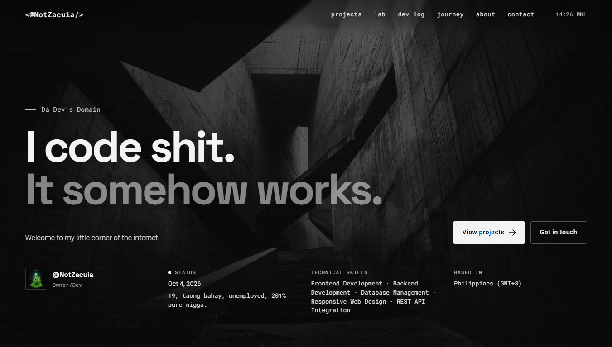
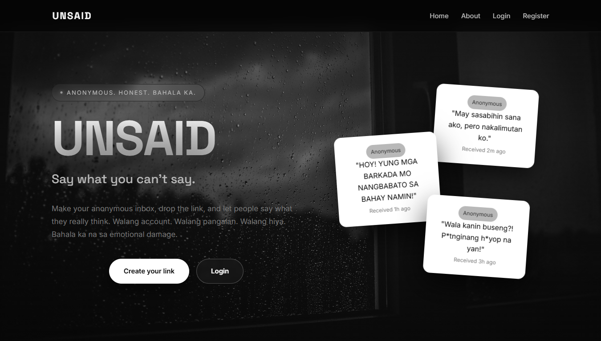
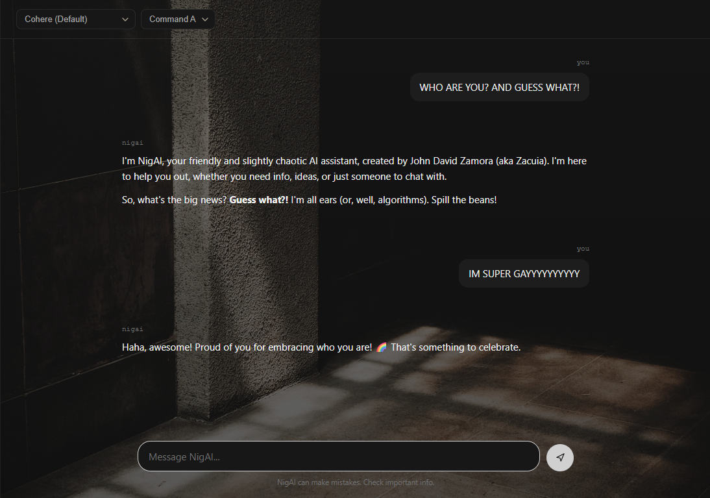
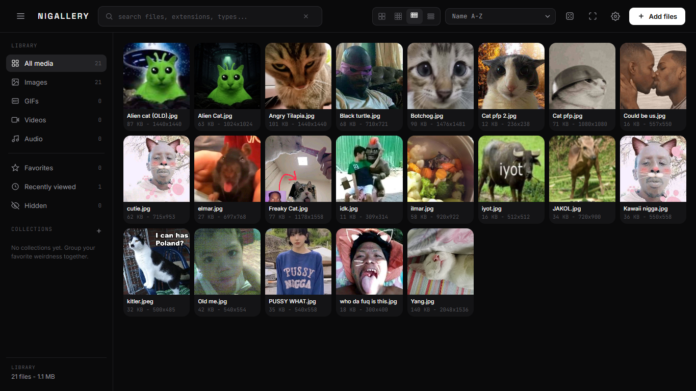
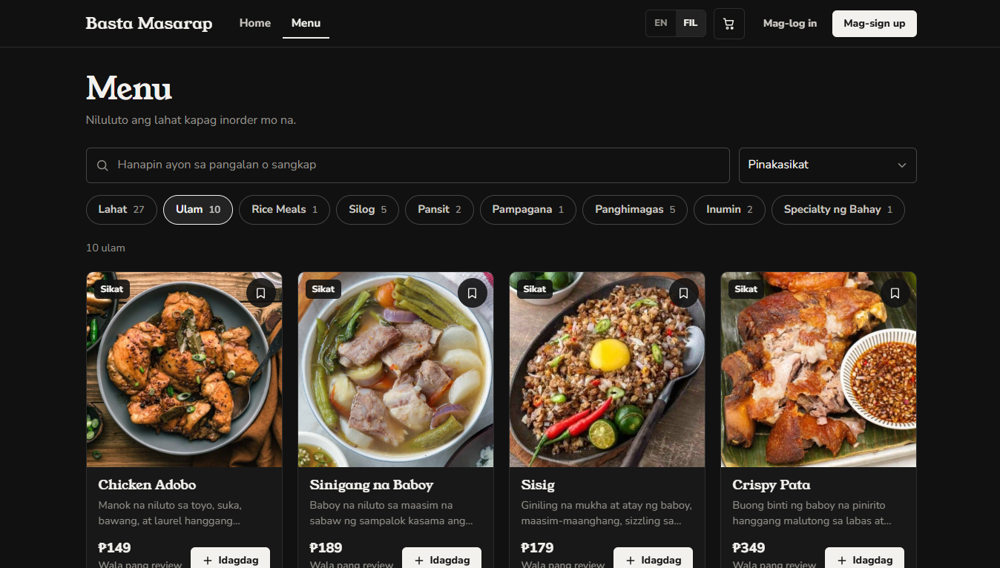
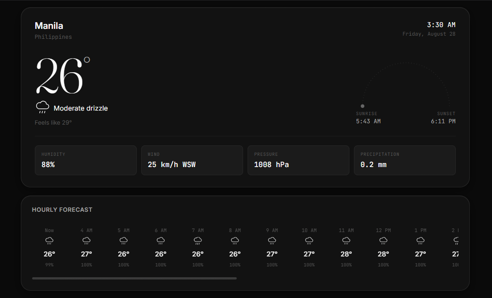
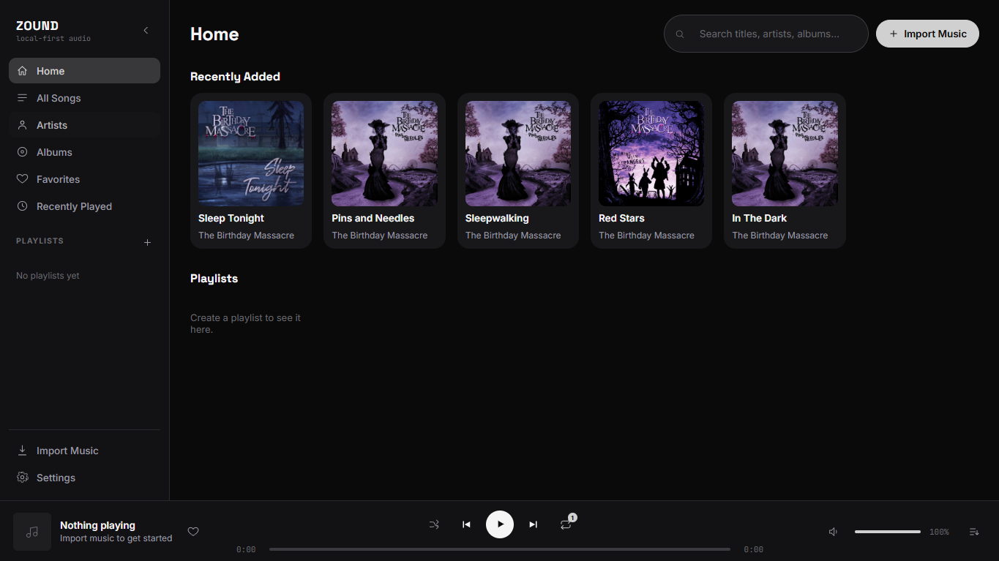
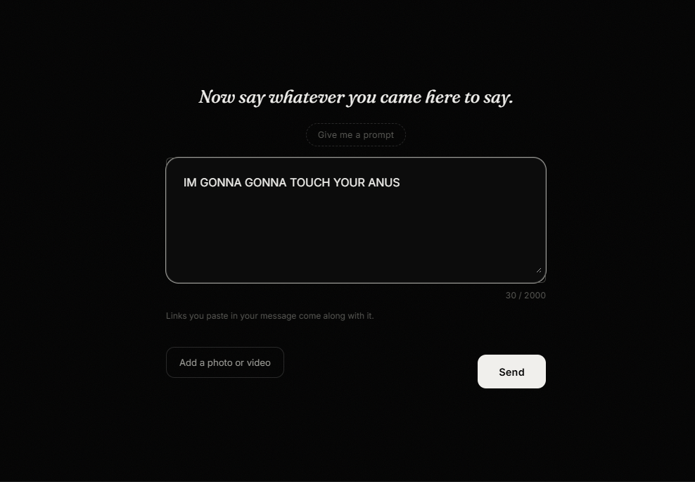
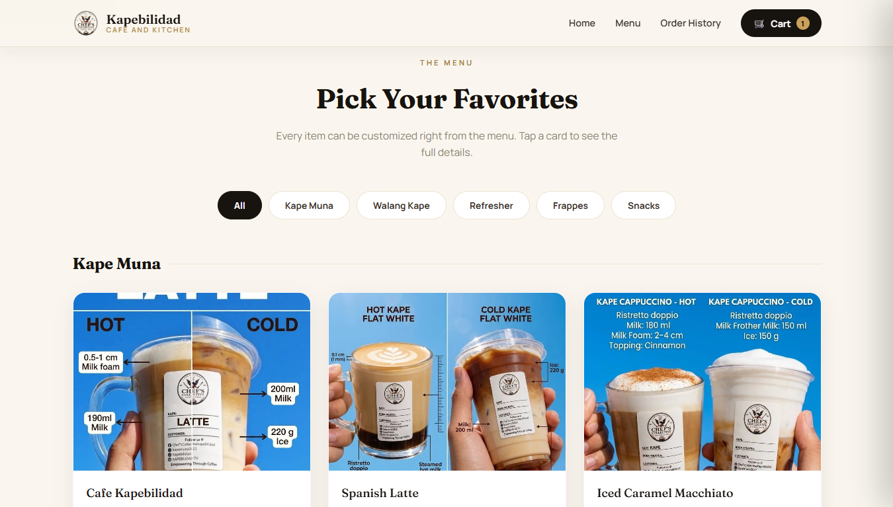

# John David Zamora

### Junior Web Developer · BSIT Student

I build practical web applications, mostly with **PHP, MySQL, JavaScript, HTML, and CSS**.

I started with simple websites, then somehow ended up building databases, admin panels, APIs, anonymous messaging systems, AI chatbots, galleries, and entire platforms.

Still learning. Still building. Still breaking shit.

---

## About Me

```text
Name       John David Zamora
Role       Junior Web Developer
Education  2nd Year BSIT Student
Location   Philippines
Focus      Web Development
Backend    PHP / MySQL
Frontend   HTML / CSS / JavaScript
Learning   Laravel / Tailwind CSS
Tools      Git / GitHub / XAMPP
```

I'm a self taught Junior Web Developer and BSIT student from the Philippines.

My main focus is **web development**, especially backend development with PHP and MySQL, while continuing to improve my frontend skills and overall application architecture.

I've built and maintained **10+ personal and academic web projects**, along with websites made for personal contacts and freelance work.

I learn best by actually building things.

---

## What I Build

```text
Web Applications
Database Driven Systems
CRUD Applications
Admin Panels
API Integrations
Responsive Websites
Authentication & User Management
File & Image Handling
Search & Filtering
Analytics
Custom CMS Systems
```

---

## Featured Projects

### Da Dev's Domain

**My personal developer platform and portfolio.**



A full stack web platform with a custom CMS, project management, GitHub API integration, visitor analytics, contact inbox, file management, search and filtering, and responsive UI.

**PHP · MySQL · JavaScript · HTML · CSS**

[Live Website](https://zacuia.gt.tc)

---

### Unsaid

**Anonymous Messaging Web Application**



A nickname based anonymous messaging platform with attachments, reporting, moderation, printable messages, and administrative controls.

**PHP · MySQL · JavaScript · HTML · CSS**

[Live Website](https://unsaid.gt.tc)

---

### NigAI

**AI Chatbot Web Application**



An API integrated AI chatbot built with PHP and JavaScript, featuring a responsive chat interface, theme support, code blocks, copy actions, chat controls, and loading states.

**PHP · JavaScript · HTML · CSS · AI API**

[Live Website](https://nigai.ct.ws/)

---

### Nigallery

**Vanilla JavaScript Image Gallery**



A lightweight gallery project built with vanilla JavaScript.

Because apparently opening a folder full of images wasn't good enough.

**JavaScript · HTML · CSS**

[Live Website](https://lilbuffy.github.io/Nigallery/)

---

## Other Projects

Some of the other things I've built:

**Basta Masarap v2**

Still fucking Basta Masarap pero v2 na my nig-



---

**Weather Weather Lang**

Weather dashboard powered by Open Meteo and Vanilla JavaScript.



---

**Zound**

Local music player for playing your own music without ads or subscriptions.



---

**AMW**

An experimental anonymous messaging project.



---

**Kapebilidad**

A PHP cafe ordering system that somehow became an entire web application.



[View all repositories](https://github.com/LilBuffy?tab=repositories)

---

## Tech Stack

### Languages


### Backend & Database


### Tools


### Learning


---

## Currently Learning

```text
Laravel
Tailwind CSS
Web Security
Better PHP Architecture
Database Design
Git & GitHub
Modern Web Development
```

The goal isn't to collect technologies. It's to understand them well enough to build something useful nganiiiiiiii.

---

## Experience

### Freelance Web Developer

Built and delivered websites for personal contacts based on their requirements.

Handled:

```text
Planning
UI Design
Feature Flow
Frontend Development
Backend Development
Database Integration
Deployment
```

### Independent Web Developer

Built and maintained **10+ personal and academic web projects**, including database driven applications, CRUD systems, and deployed web applications.

---

## GitHub Stats


---

## Find Me

**Portfolio**
https://zacuia.gt.tc

**GitHub**
https://github.com/LilBuffy

---

```text
learn → build → break → debug → improve → repeat
```

### Learning shit, breaking shit, and getting better at web development.
